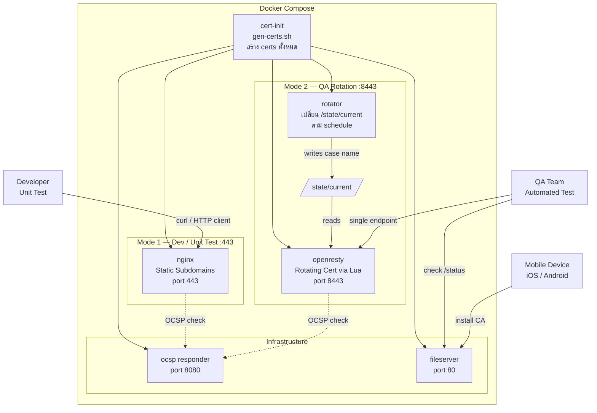

# SSL Test Lab — How to Use (Application Guide)

> ระบบทดสอบ SSL/TLS Certificate แบบ self-contained ด้วย Docker Compose
> สำหรับนักพัฒนาและ QA ทีมทดสอบ Certificate Validation Logic ของ Application

---

## Architecture



---

## 1. Prerequisites

| สิ่งที่ต้องมี | รายละเอียด |
|---|---|
| Docker & Docker Compose | v2.x ขึ้นไป |
| DNS Record | `A test → <EC2_PUBLIC_IP>` และ `A *.test → <EC2_PUBLIC_IP>` |
| Public IP | ของ server ที่ deploy (ใช้กับ OCSP) |

---

## 2. App Setup (Initial)

### Step 1 — สร้างไฟล์ `.env`

```dotenv
OCSP_HOST=<EC2_PUBLIC_IP>       # IP ของ server ที่ client เข้าถึง OCSP ได้
BASE_DOMAIN=test.mxlabs.cloud   # Base domain
ROTATION_LOG=true               # log การ rotate
```

> **หมายเหตุ:** เปลี่ยน `OCSP_HOST` เป็น public IP จริงของ server ก่อน deploy

### Step 2 — Start ระบบ

```bash
docker compose up -d
```

`cert-init` จะรันก่อนแล้ว exit เมื่อสร้าง certificates ครบ จากนั้น services ทั้งหมดจะ start

### Step 3 — ตรวจสอบ services พร้อมใช้งาน

```bash
# ตรวจสอบ status ของทุก service
docker compose ps

# ดู log cert-init ว่า generate certs สำเร็จ
docker compose logs cert-init

# ทดสอบ connectivity
curl http://test.mxlabs.cloud/status
```

### Step 4 — ติดตั้ง CA Certificate (เพื่อให้ App เชื่อถือ Fake CA)

**iOS:**
1. เปิด Safari → `http://test.mxlabs.cloud/ca.mobileconfig`
2. ติดตั้ง Profile
3. `Settings → General → About → Certificate Trust Settings` → เปิด Trust

**Android:**
1. เปิด `http://test.mxlabs.cloud/ca.crt`
2. ติดตั้งเป็น CA Certificate

**Application / HTTP Client:**
```bash
# ใช้ flag --cacert กับ curl
curl --cacert ./certs/ca/ca.crt https://valid.test.mxlabs.cloud
```

---

## 3. Unit Test — Dev Mode (Port 443)

> ใช้สำหรับ **developer** ทดสอบ specific scenario แบบ static  
> แต่ละ subdomain เสิร์ฟ certificate case เดิมตลอดเวลา

### Endpoint Table

| # | Subdomain | Certificate Case | Expected Behavior | curl ทดสอบ |
|---|---|---|---|---|
| 1 | `valid.test.mxlabs.cloud` | ✅ Valid | SSL handshake สำเร็จ | `curl --cacert ./certs/ca/ca.crt https://valid.test.mxlabs.cloud` |
| 2 | `expired.test.mxlabs.cloud` | ❌ Expired | App ต้องปฏิเสธ (cert หมดอายุ 2023) | `curl -kv https://expired.test.mxlabs.cloud` |
| 3 | `notyet.test.mxlabs.cloud` | ❌ Not Yet Valid | App ต้องปฏิเสธ (cert ยังไม่เริ่ม valid) | `curl -kv https://notyet.test.mxlabs.cloud` |
| 4 | `wronghost.test.mxlabs.cloud` | ❌ Wrong Hostname | App ต้องปฏิเสธ (SAN = `evil.attacker.com`) | `curl -kv https://wronghost.test.mxlabs.cloud` |
| 5 | `selfsigned.test.mxlabs.cloud` | ❌ Self-Signed | App ต้องปฏิเสธ (ไม่มี CA chain) | `curl -kv https://selfsigned.test.mxlabs.cloud` |
| 6 | `untrustedca.test.mxlabs.cloud` | ❌ Untrusted CA | App ต้องปฏิเสธ (ออกโดย Rogue CA) | `curl -kv https://untrustedca.test.mxlabs.cloud` |
| 7 | `weakkey.test.mxlabs.cloud` | ⚠️ Weak Key | App ควรปฏิเสธ (RSA 1024-bit) | `curl -kv https://weakkey.test.mxlabs.cloud` |
| 8 | `wrongusage.test.mxlabs.cloud` | ❌ Wrong Usage | App ต้องปฏิเสธ (EKU = emailProtection, ไม่มี serverAuth) | `curl -kv https://wrongusage.test.mxlabs.cloud` |
| 9 | `wildcard.test.mxlabs.cloud` | ❌ Wrong Domain Wildcard | App ต้องปฏิเสธ (wildcard ของ `other-domain.com`) | `curl -kv https://wildcard.test.mxlabs.cloud` |
| 10 | `revoked.test.mxlabs.cloud` | ❌ Revoked (OCSP) | App ต้องปฏิเสธ (OCSP = REVOKED) | ดู OCSP section ด้านล่าง |
| 11 | `missingchain.test.mxlabs.cloud` | ❌ Missing Intermediate | App ต้องปฏิเสธ (chain ไม่ครบ ขาด intermediate CA) | `curl -kv https://missingchain.test.mxlabs.cloud` |

### Response Format (ทุก endpoint)

```json
{
  "case": "expired",
  "status": "ok",
  "message": "..."
}
```

> HTTP 200 เสมอ — SSL error เกิดที่ handshake layer ก่อนถึง HTTP

### Unit Test ด้วย openssl

```bash
# ดู cert details (dates, subject, SAN)
echo | openssl s_client -connect expired.test.mxlabs.cloud:443 2>/dev/null \
  | openssl x509 -noout -dates -subject

# ตรวจ OCSP status สำหรับ revoked cert
openssl ocsp \
  -issuer ./certs/ca/ca.crt \
  -cert ./certs/server/revoked.crt \
  -url http://${OCSP_HOST}:8080 \
  -resp_text

# ดู SPKI hash ของ Fake CA (ใช้กับ Certificate Pinning)
openssl x509 -in ./certs/ca/ca.crt -pubkey -noout \
  | openssl pkey -pubin -outform DER \
  | openssl dgst -sha256 -binary \
  | base64
```

---

## 4. QA Mode Setup (Port 8443)

> ใช้สำหรับ **QA team** ทดสอบผ่าน **endpoint เดียว**  
> ระบบจะ rotate certificate อัตโนมัติตาม schedule

### QA Endpoint

```
https://api.test.mxlabs.cloud:8443
```

### Step 1 — ตรวจสอบ current scenario ก่อน test

```bash
curl http://test.mxlabs.cloud/status
```

Response:
```json
{
  "current_case": "expired",
  "next_case": "notyet",
  "next_in_seconds": 47,
  "duration_seconds": 120,
  "cycle_total_minutes": 25,
  "schedule": [
    { "case": "valid",        "duration_seconds": 300 },
    { "case": "expired",      "duration_seconds": 120 },
    { "case": "notyet",       "duration_seconds": 120 },
    { "case": "wronghost",    "duration_seconds": 120 },
    { "case": "selfsigned",   "duration_seconds": 120 },
    { "case": "untrustedca",  "duration_seconds": 120 },
    { "case": "weakkey",      "duration_seconds": 120 },
    { "case": "wrongusage",   "duration_seconds": 120 },
    { "case": "wildcard",     "duration_seconds": 120 },
    { "case": "revoked",      "duration_seconds": 120 },
    { "case": "missingchain", "duration_seconds": 120 }
  ]
}
```

### Step 2 — รัน test กับ QA endpoint

```bash
# ทดสอบ QA endpoint (ใช้ -k เพื่อข้าม cert validation ถ้ายังไม่ install CA)
curl -kv https://api.test.mxlabs.cloud:8443

# ทดสอบพร้อม CA trust
curl --cacert ./certs/ca/ca.crt https://api.test.mxlabs.cloud:8443
```

### Rotation Schedule

| Case | Duration | หมายเหตุ |
|---|---|---|
| `valid` | 5 นาที | ✅ ช่วงเดียวที่ SSL สำเร็จ |
| `expired` | 2 นาที | |
| `notyet` | 2 นาที | |
| `wronghost` | 2 นาที | |
| `selfsigned` | 2 นาที | |
| `untrustedca` | 2 นาที | |
| `weakkey` | 2 นาที | |
| `wrongusage` | 2 นาที | |
| `wildcard` | 2 นาที | |
| `revoked` | 2 นาที | |
| `missingchain` | 2 นาที | |
| **รวม 1 รอบ** | **25 นาที** | วนซ้ำต่อเนื่อง |

### Step 3 — QA App Build — Certificate Pinning

สำหรับ build ที่ใช้ **certificate pinning**, ต้องใช้ SPKI hash ของ Fake CA:

```bash
# ดึง SPKI hash (พิมพ์อัตโนมัติตอนจบ gen-certs.sh ด้วย)
openssl x509 -in ./certs/ca/ca.crt -pubkey -noout \
  | openssl pkey -pubin -outform DER \
  | openssl dgst -sha256 -binary \
  | base64
```

ใส่ค่าที่ได้ใน config ของ QA build เช่น:
```
sha256/<BASE64_HASH>
```

---

## 5. Infrastructure Endpoints

| Endpoint | Port | รายละเอียด |
|---|---|---|
| `GET http://test.mxlabs.cloud/status` | 80 | Current rotation status + schedule (JSON) |
| `GET http://test.mxlabs.cloud/ca.crt` | 80 | Download Fake CA Certificate (Android install) |
| `GET http://test.mxlabs.cloud/ca.mobileconfig` | 80 | iOS Configuration Profile สำหรับ install CA |
| OCSP Responder `http://<OCSP_HOST>:8080` | 8080 | ตรวจสอบสถานะ certificate (revoked/good) |

---

## 6. Troubleshooting

| ปัญหา | สาเหตุ | วิธีแก้ |
|---|---|---|
| `cert-init` exit แล้ว services อื่น start ไม่ได้ | gen-certs.sh error | `docker compose logs cert-init` |
| `curl: (60) SSL certificate problem` | ยังไม่ได้ install CA | ใช้ `--cacert ./certs/ca/ca.crt` หรือ install CA ก่อน |
| OCSP ไม่ตอบสนอง | `OCSP_HOST` ใน `.env` ผิด | แก้เป็น public IP จริงแล้ว `docker compose up -d --force-recreate` |
| QA endpoint ไม่ rotate | `rotator` service หยุด | `docker compose restart rotator` |
| ไม่รู้ current QA scenario | — | `curl http://test.mxlabs.cloud/status` |

---

## 7. Quick Reference

```bash
# Start ระบบ
docker compose up -d

# Stop ระบบ
docker compose down

# Rebuild certs ใหม่ทั้งหมด
docker compose down
rm -rf certs/ca/index.txt* certs/ca/serial* certs/intermediate-ca/ certs/server/*.crt certs/server/*.key
docker compose up -d

# ดู log ทุก service
docker compose logs -f

# ดู log rotator
docker compose logs -f rotator

# ตรวจสอบ current QA scenario
curl http://test.mxlabs.cloud/status
```
